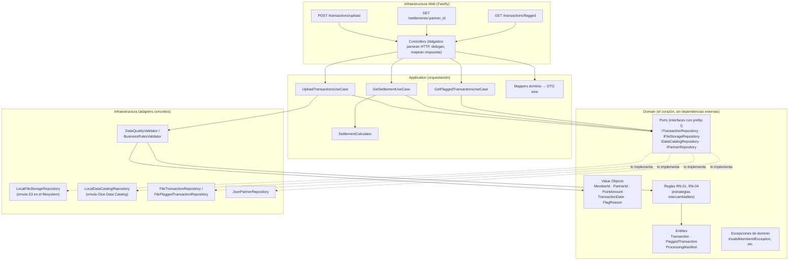

# FinCard — Módulo de Liquidación de Puntos y Aliados

Servicio para que los aliados comerciales de FinCard (cafeterías, gasolineras, tiendas)
suban sus transacciones de puntos por CSV, el sistema las valide fila por fila, aplique
las reglas de negocio de fraude/límites, y quede disponible la liquidación por aliado
en un rango de fechas.

## Cómo ejecutar localmente

Necesitás Node.js 22 o superior (yo lo probé con Node 24).

```bash
npm install
npm run dev
```

Con eso ya tienes el servidor en `http://localhost:3000`, con recarga
automática cada vez que guardás un archivo. Si prefieres no usar el modo watch:

```bash
npm run build
npm start
```

Otros comandos que vas a usar seguido:

```bash
npm test          # corre toda la suite (93 tests)
npm run typecheck  # solo TypeScript, sin compilar
```

El puerto y el host son configurables con las variables de entorno `PORT` y
`HOST` por si `3000` ya lo tenés ocupado. Todo lo que el sistema "guarda"
(transacciones, manifests, el catálogo emulado) queda en una carpeta
`./storage` en la raíz del proyecto, se genera sola la primera vez que subís
un archivo, y si en algún momento querés arrancar de cero simplemente la
borrás.

### Con Docker, si preferís no instalar Node

```bash
docker compose up --build
```

Ese único comando hace el build de la imagen, levanta el contenedor, mapea
el puerto 3000 y monta `./storage` como volumen para que los datos persistan
entre reinicios.

## Por qué elegí Arquitectura Hexagonal

Cuando uno arma un sistema que tiene que hablar con S3, con un catálogo de
datos, y que en algún momento va a migrar de "emulado en el filesystem local"
a "AWS real", la pregunta que me hice fue: ¿dónde pongo la frontera entre "la
lógica de negocio de FinCard" y "los detalles de con qué proveedor hablo"?
Esa pregunta es exactamente lo que resuelve Ports & Adapters.

La idea central es simple aunque el nombre suene grande: el dominio (las
reglas de validación, las entidades, las 4 reglas de negocio RN-01 a RN-04)
no sabe que existe Fastify, ni que existe el filesystem, ni que existe AWS.
Solo conoce interfaces, "necesito algo que guarde transacciones", "necesito
algo que archive un batch" y quien implementa esas interfaces vive afuera,
en la capa de infraestructura.



¿Y esto en la práctica qué me da, más allá de que "se vea prolijo"? Dos cosas
muy concretas:

1. **El día que haya que ir a AWS real, el cambio es quirúrgico.**
   `LocalFileStorageRepository` se reemplaza por un adapter con
   `@aws-sdk/client-s3`, `LocalDataCatalogRepository` por uno con
   `@aws-sdk/client-glue`, y ninguno de los dos cambios toca una sola línea
   del dominio ni de los casos de uso solo se cambia qué instancia se
   inyecta en el arranque (`src/index.ts`).
2. **Los casos de uso se testean sin levantar nada real.** Nada de Fastify,
   nada de filesystem, nada de red, se les pasan implementaciones falsas en
   memoria de cada puerto y se verifica el comportamiento. Por eso la suite
   de 93 tests corre en un par de segundos.

La otra decisión que tomé, más de detalle: cada regla de negocio (RN-01 a
RN-04) es una clase separada e intercambiable, no un bloque gigante de ifs.
Si mañana FinCard agrega una RN-05, se escribe una clase nueva y se agrega a
la lista no hay que tocar ni entender las reglas que ya existen.

## Tecnologías

| Para qué | Qué usé | Por qué esa y no otra |
|---|---|---|
| Runtime y lenguaje | Node.js + TypeScript en modo estricto | pedido explícito del enunciado |
| Servidor HTTP | Fastify 5 | también pedido; además su sistema de schemas se integra directo con la documentación |
| Documentación de API | `@fastify/swagger` + `@fastify/swagger-ui` | genera el spec OpenAPI a partir de los mismos schemas que ya usa Fastify para validar no hay que mantener la doc por separado |
| Carga de archivos | `@fastify/multipart` | RF-01 pide recibir un archivo real, no un texto pegado en el body |
| Tests | Vitest | arranca sin configuración sobre TypeScript, misma forma de escribir tests que Jest, corre rápido |
| "S3" y "Glue" en desarrollo | Filesystem local y JSON local | cumplen el mismo contrato (la misma interfaz) que tendría el SDK real de AWS, así que el reemplazo después es directo |

## Estructura y capas

```
src/
  domain/          # el núcleo: entidades, value objects, reglas, puertos (interfaces).
                    # No importa nada de fuera, ni Fastify, ni el filesystem, ni AWS.
  application/      # casos de uso: orquestan el dominio. Convierten resultados
                    # de dominio a DTOs de respuesta (mappers) antes de exponerlos.
  infrastructure/    # todo lo concreto: el servidor Fastify, los adapters que
                    # implementan los puertos, las reglas de negocio como
                    # estrategias, la persistencia en archivos.
  shared/           # utilidades sin opinión de negocio (Result, constantes, fechas).
```

Documenté las decisiones más discutibles (y hay varias el enunciado deja
espacio a interpretación en más de un punto) en `docs/ADR.md`, por si querés
ver el razonamiento completo detrás de cada una.
